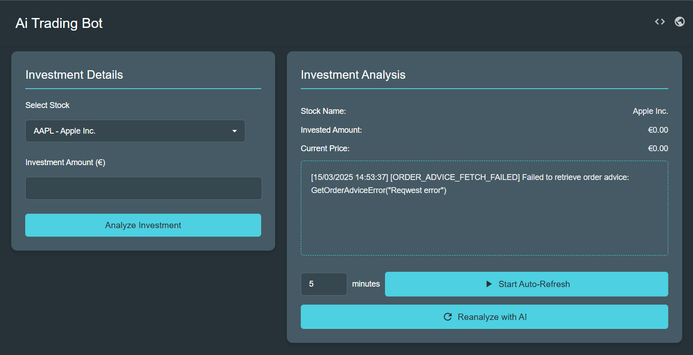

# AI Trading bot

The Investor Trading Bot automates stock investments using AI to analyze historical data and news to identify trading patterns.

Users can input an investment amount for a selected stock, and the bot will manage buying and selling until the user
decides to stop.

UI:


## Table of Contents

- [Features](#features)
- [Installation](#installation)
- [Usage](#usage)
- [License](#license)

## Features

- Let the AI decide weather or not to sell or buy a selected stock with a provided amount
- Set a automatic auto-reanalyze timer
- Manually reanalyze

## Installation

1. Execute ```git clone https://github.com/Benedikt-Hollerauer/ai-trading-bot.git```
2. Install the [Interactive Brokers Gateway](https://www.interactivebrokers.com/en/trading/ibgateway-stable.php)
3. Install [Ollama](https://ollama.com/)
4. Install a AI model with [Ollama search](https://ollama.com/search)
5. Create a ```config.rs``` file and create a new instanze of Config model with a custom [Alpha vantage API key](https://www.alphavantage.co/) and a Connection URL for the IB gateway (Default: 127.0.0.1:4002) and the installed Ollama model:

```rust
use crate::models::Config;

pub(crate) const CONFIG: Config = Config {
    alpha_vantage_api_key: "[Alpha vantage API key]",
    interactive_brokers_connection_url_with_port: "[Connection URL for the IB gateway (Default: 127.0.0.1:4002)]",
    ollama_model: "[Ollama model. E.g.: 'deepseek-r1:1.5b']",
};
```

## Usage

1. Run the Ollama app
2. Run and sign in to the Interactive Brokers Gateway app
3. Execute the main method in [main.rs](src/main.rs?plain=L62)
4. Go to ```http://127.0.0.1:3000/```

## License

This project is licensed under the MIT license.